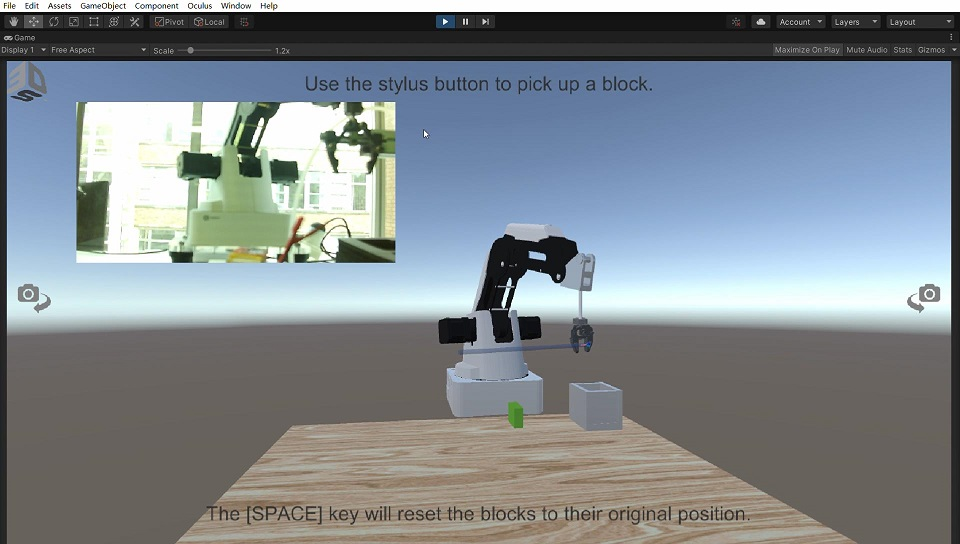

# Project for Haptic Device
This project is using a haptic device names Geomagic Touch to control a virtual robot in Unity, then use CRI code to control the physical Dobot.

# Implement
## Haptic Device
At first, you need to install the driver for Geomagic Touch in your computer. You can download it here: [Touch Driver](https://www.3dsystems.com/haptics-devices/touch/documents).

##Unity
In this project, you need to add a plugin to support Geomagic Touch in your unity account. You can find this plugin [here](https://assetstore.unity.com/packages/tools/integration/3d-systems-openhaptics-unity-plugin-134024) 

