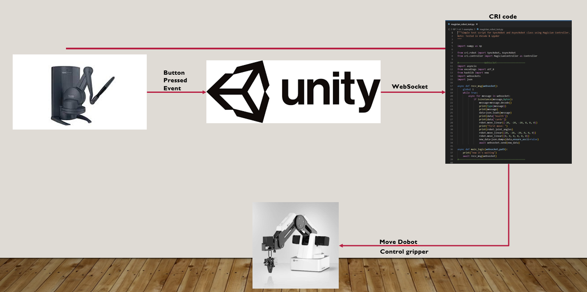
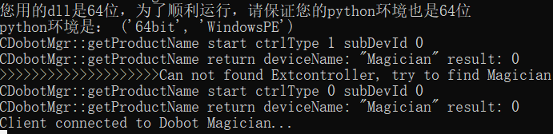

# Teleoperation
 This is a simple robot project based on Unity Engine and dobot magician. This project amis to create a digital twin for a Dobot magician. I designed two different interaction methods, the first one is using haptic device Geomagic TouchX to control the virtual robot and the relevant code is in the folder "HapticDevice", the second one is using VR device Oculus Quest2 and the relevant code is in the folder "MixReality".   

 ## Environment:
· Python 3.7.13  
· Unity 2020.3.32  

## Installation
### · CRI
Follow the installation instructions of [CRI](https://github.com/nlepora/cri), after completing CRI installation, find the "magician_robot_test" file in the cri/examples directory, open cmd and use command "python magician_robot_test.py" to run this file. If there's nothing wrong, then you can get output in the command like below:  
  
Sometimes your cmd may tell you that it has linked to a device but this device is not a dobot magician, that's because your port may be occupied by other program, you need to release the port and give it to the dobot magician.

### · Unity
When using Unity engine to run this project, some plugins are required to implement. The first plugin is URDF importer, you can follow [this](https://github.com/Unity-Technologies/URDF-Importer#integrate-urdf-importer-into-unity-project) to add URDF importer into Unity engine.

Another plugin is Final IK. You need to purchase it in Unity asset store. This plugin is for Dobot inverse kinematic computation. If you have other choice for IK computation, you can change this plugin to your choice.